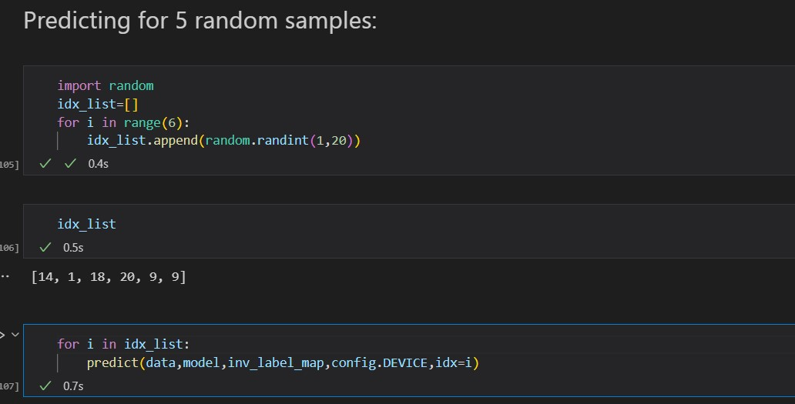
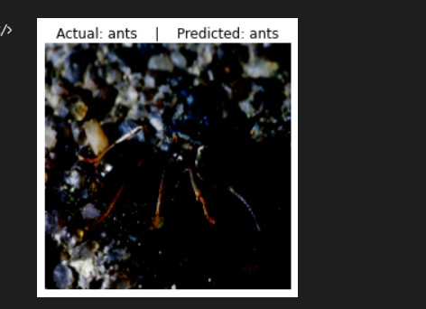
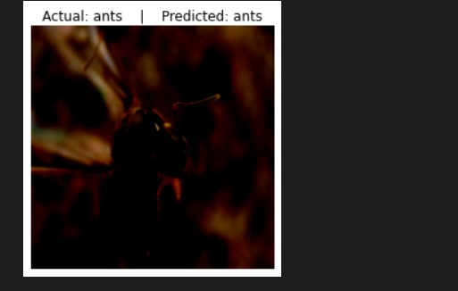
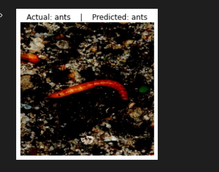

# ALexNet-Pytorch using TransferLearning:
## Project Description 📄

❄️ Built a Classification Model using Pytorch to predict 'Bees'/'Ants' based on Image.

# Data:
    Number of classes: 2

    HymenopteraMine is a data mining tool that integrates all of the genomes in HGD with biological data from a variety of sources. The goal of HymenopteraMine is to
    accelerate genomics analysis by enabling researchers without scripting skills to create and export customized annotation datasets merged with their own research
    data for use in downstream analyses. HymenopteraMine facilitates cross-species data mining based on orthology and supports meta-analyses by tracking identifiers
    across gene sets and genome assemblies.

    
## Model Overview:
We are using the ALexnet with pytorch as it provides fast training due to less trainable parameters and result is also good..
## Prediction:
<table>
  <tr>
    <td>Testing for 5-Images</td>
  </tr>
  <tr>
    <td>
  </tr>
 </table>
 <table>
  <tr>
    <td>For 1st Image </td>
    <td>For 2nd Image </td>
    <td>For 3rd Image </td>
  </tr>
  <tr>
    <td></td>
    <td></td>
    <td></td>
  </tr>
 </table>
